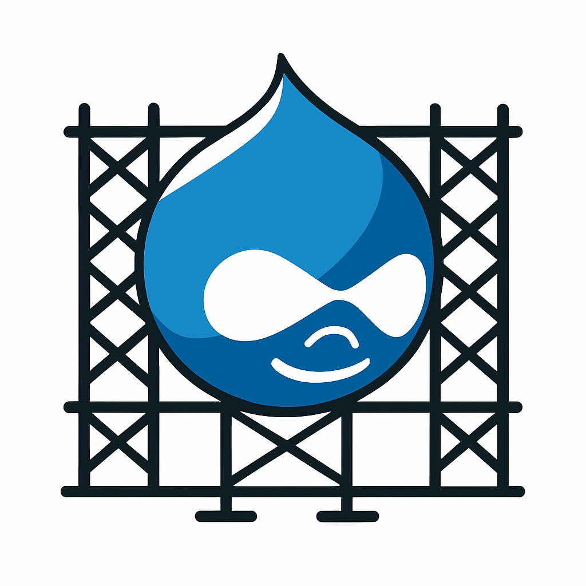

<p align="center"></p>

# Drupal CMS Project Demo

[](https://github.com/jasonluttrell/drupal-demo/actions)
[](https://opensource.org/licenses/GPL-2.0)
[](https://github.com/jasonluttrell/drupal-demo/commits/main)
[](https://github.com/jasonluttrell/drupal-demo)

This is a public-facing demo of a Drupal CMS project scaffolded using DDEV and Composer, built for showcasing modern development best practices with Git, modern DevOps workflows, configuration management, custom code, and containerized local environments. It is intended to be a full-featured demonstration of a curated baseline of Drupal 11-compatible contributed modules.

🔗 [Preview site via DDEV](https://drupal-demo.ddev.site)

---

## 🚀 Getting Started

> This stack uses [DDEV](https://ddev.com), PHP 8.4, Drupal 11, and Composer 2.x.

1. Clone the Git repo
2. Install DDEV ([Get Started Guide](https://ddev.com/get-started/))
3. Open your terminal and `cd` into this project root
4. Run the following commands:
```bash
ddev start
ddev composer install
ddev launch
```
5. If needed, install the site:
```bash
ddev drush site:install standard \
  --account-name=admin \
  --account-pass=admin \
  --account-mail=admin@example.com \
  --site-name="Drupal Demo Site" \
  --yes
```

---

## 🧠 Project Features

* Drupal CMS starter kit (drupal/cms)
* DDEV local environment

---

## 🐘 Running Drupal with PostgreSQL (Optional)

This project uses MariaDB by default, but it also includes optional support for running Drupal on PostgreSQL 17 using DDEV.

The PostgreSQL setup is stored in the archive branch:
```bash
archive/postgresql-support
```

This branch contains a DDEV override file:
```bash
.ddev/config.postgres.yaml
```

The goal was to confirm that Drupal installs and runs normally on PostgreSQL without changing the main development environment. The test was successful.

If you want to apply this to your own branch, you can cherry-pick the commit:
```bash
git cherry-pick <commit>
```

After switching database engines, reinstall Drupal so it initializes with the correct driver:
```bash
ddev restart
ddev drush site:install standard --yes
```

PostgreSQL support remains optional and is provided for teams or environments that prefer Postgres or require it for compliance.

---

## 🛠 Commit Convention (50/72 Rule)

This repo uses structured Git commits like:
```bash
📦 release: Initial snapshot for Drupal CMS demo

Sets up drupal/cms with DDEV, Composer, and verified Drush install.
Includes PHP 8.4, MariaDB 11.8, and base environment configuration.
```

🔗 See [CONTRIBUTING.md](CONTRIBUTING.md) for full list of Git tags (`feat`, `fix`, `chore`, etc.).

---

## 🔖 Current Version

**Release Tag:** `dev02`  
**Drupal Core:** `11.2.9`  
**Full Version:** `25.12.10-dev02+d11.2.9`  
This tag captures the Drupal CMS post-installation updates.

---

## 📝 License
This project is open-sourced under the [GNU GPL v2 or later](https://www.gnu.org/licenses/old-licenses/gpl-2.0.html).

---

## 🤝 Contact

Feel free to fork or reach out via GitHub: @jasonluttrell
